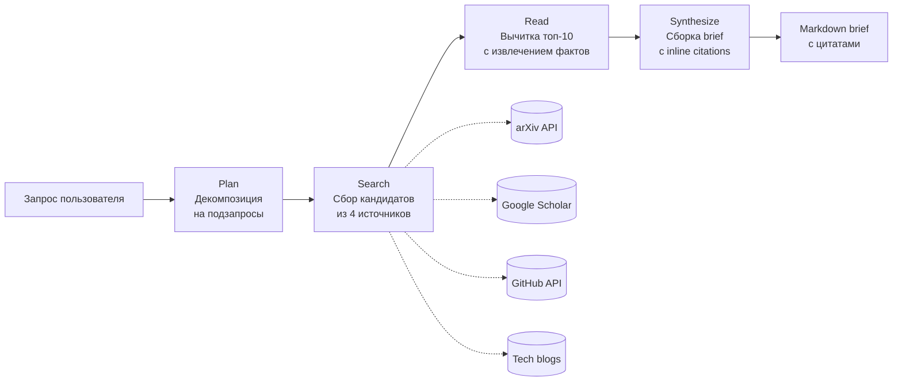

# Проект 1: Technical Research Agent

> Hero-проект портфолио для fulltime remote AI Agent роли.
> Цель — показать hiring managers что я умею строить production-grade агентов
> и измерять их качество как senior-инженер.

---

## Краткое описание

AI-агент, который проводит технический research по запросу пользователя.
Получает на вход формулировку темы, идёт в открытые источники, собирает релевантные материалы, читает их и возвращает structured brief с цитатами.

Целевая аудитория агента — AI-инженеры, ML-исследователи, технические фаундеры.
Это **те же люди, которые меня будут нанимать** — прямая воронка к hiring audience.

---

## Что агент делает (use case)

**Пример запроса:**
> «Найди и сравни современные подходы к agent memory в 2025-2026.
> Дай 5-10 ключевых источников, краткие выводы, и матрицу сравнения подходов.»

**На выходе:** structured brief в Markdown:

- Executive summary (3-5 предложений)
- Key findings — основные подходы, с inline-цитатами и ссылками на источники
- Comparison matrix — таблица сравнения подходов
- Open questions — что осталось спорным или неясным

Время выполнения: 2-5 минут.

---

## Архитектура

Агент работает как pipeline из 4 этапов: **Plan → Search → Read → Synthesize**.

### Этап 1: Plan
Claude разбивает запрос пользователя на конкретные подзапросы для поиска.
Один запрос «agent memory 2025» превращается в несколько: «episodic memory LLM agents», «Mem0 architecture», «long-term memory benchmarks».

### Этап 2: Search
Агент идёт в 4 источника и собирает кандидатов на чтение:
- **arXiv** — академические статьи (через API)
- **Google Scholar** — broader academic search (через браузерный агент)
- **GitHub** — код и репозитории (через API)
- **Технические блоги** — Anthropic, OpenAI, LangChain, личные блоги (через web search)

На выходе — 30-50 кандидатов с метаданными (URL, заголовок, snippet, источник).
**Ничего ещё не прочитано целиком.** Это критично для экономии токенов.

### Этап 3: Read
Из 30-50 кандидатов Claude выбирает топ-10 самых релевантных и читает их целиком.

Из каждого источника извлекаются 3 элемента:
- Главный тезис автора
- Ключевые методы / цифры
- Точные цитаты (для grounding в финальном brief)

**Grounding критичен** — каждое утверждение в финальном brief должно быть привязано к источнику. Без этого агент галлюцинирует.

### Этап 4: Synthesize
Агент собирает финальный brief из извлечённых фактов.
**Inline citations** на каждое утверждение — ссылка на источник.

---

## Стек

| Слой | Инструмент | Зачем |
|---|---|---|
| Orchestration | LangGraph | Каждый этап — отдельная нода в графе. Маст-хэв в job postings. |
| Основная LLM | Claude Sonnet 4.5 | Plan, Read, Synthesize — где нужно качество |
| Дешёвая LLM | Claude Haiku 4.5 | Ранжирование кандидатов после Search |
| Браузерный агент | Stagehand + Browserbase | Google Scholar (нет API) |
| Long-term memory | Mem0 | Кэш находок между сессиями |
| Observability | Langfuse | Traces, debugging, eval data source |
| Деплой | Modal или Railway | Публичная ссылка для демо |

Конкретные версии библиотек уточняются в момент сборки (Claude Code сам подтянет актуальные через context7 или web search).

---

## Eval Pipeline

Это вторая половина проекта — **критическая часть для fulltime-сигнала**.

### Что измеряем

Три метрики:

**1. Правильность (нет галлюцинаций).**
Каждое утверждение в brief'е имеет inline citation.
LLM-as-judge берёт пару (утверждение, источник) и проверяет — действительно ли это в источнике написано.
Метрика: % supported claims.

**2. Полнота (нашёл важное).**
Для синтетических задач (где правильный ответ известен заранее) — recall: из ключевых источников сколько найдено.
Для реальных задач — LLM-as-judge по rubric.

**3. Полезность (brief реально помогает).**
Pairwise comparison: LLM-as-judge сравнивает два brief'а на один запрос (старая версия vs новая) и говорит какой полезнее.
Метрика: win rate новой версии против baseline.

### Откуда берём задачи

50 задач, два источника:

- **25 реальных задач** — взяты из Twitter, Reddit r/MachineLearning, Hacker News тредов. Реальные вопросы реальных AI-инженеров.
- **25 синтетических задач** — с заранее известным правильным ответом (для автоматической проверки recall).

### Pass^k

Каждая задача прогоняется 4 раза. Засчитывается только если решена все 4 раза подряд (метрика **pass^4**).
Это стандарт измерения reliability для агентов в 2026 — один успешный прогон ничего не доказывает.

---

## CI / GitHub Actions

Каждый pull request автоматически запускает eval pipeline.

**Что происходит:**

1. Я делаю изменение в коде / промпте, открываю PR на GitHub
2. GitHub Actions запускает eval на 50 задачах через новую версию агента
3. Через 15-20 минут в PR появляется comment-бот: метрики до и после, дельта по каждой
4. Если регрессия больше порога — merge заблокирован

Это сигнал production-thinking. Большинство фрилансеров так не делают — отсюда премия за «production experience» в job postings.

---

## Что должно быть на выходе (deliverables)

- ✅ GitHub-репозиторий с понятным README (проблема → решение → архитектурная диаграмма → стек → метрики → как запустить)
- ✅ Публичная ссылка на работающий агент (можно потрогать)
- ✅ Mermaid-диаграмма архитектуры в README
- ✅ Eval-датасет (50 задач) — публичный JSON в репозитории
- ✅ GitHub Actions конфиг для eval CI
- ✅ Langfuse public-traces (можно ссылаться на конкретный run)
- ✅ Loom-видео 2-3 минуты с демо
- ✅ Технический write-up «How I built a production Claude agent with eval CI» (dev.to / Medium)

---

## Hiring signals, которые проект закрывает

- LangGraph + multi-step agent orchestration
- Tool use (search, read, browse) с grounding
- Long-term memory (Mem0)
- Observability и production traces (Langfuse)
- Eval-driven development (LLM-as-judge, pass^k)
- CI/CD для non-deterministic systems
- Production deployment (Modal/Railway)
- Технический write-up = коммуникация на английском

Это полный набор сигналов senior AI Agent Engineer для fulltime remote роли.
