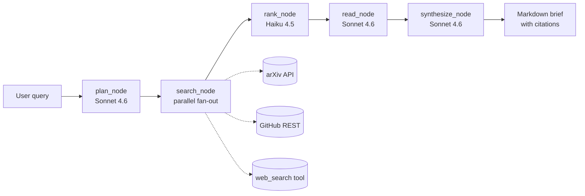

# Technical Research Agent

[](https://github.com/Shcherbin96/ai-research-agent/actions/workflows/tests.yml)
[](https://github.com/Shcherbin96/ai-research-agent/actions/workflows/eval.yml)

> Production-grade AI agent that researches a technical topic on demand and returns a grounded markdown brief with inline citations.

**Try it live** — interactive UI deployed on Modal:

### 🌐 [https://romanserbin96--ai-research-agent-research.modal.run](https://romanserbin96--ai-research-agent-research.modal.run)

Or hit the JSON API directly:

```bash
curl -X POST https://romanserbin96--ai-research-agent-research.modal.run/api/research \
  -H "Content-Type: application/json" \
  -d '{"query": "agent memory approaches in 2025-2026"}'
```

A typical run: ~60-120 seconds, 5-10 citations, fully grounded against arXiv papers + GitHub READMEs + Anthropic web_search results.

**Inspect a real run:** [public Langfuse trace](https://cloud.langfuse.com/public/traces/bc2b23ae0e1e0a525a0cf69e1bb02d00) — see the full hierarchical span tree (5 nodes + 8 LLM calls), input/output prompts, and per-call token usage for the query *"Mem0 architecture for LLM agent memory"*.

This is the MVP slice of the project described in [`01-technical-research-agent.md`](01-technical-research-agent.md). The full project also adds an eval pipeline (50 tasks, pass^4, LLM-as-judge), GitHub Actions CI, Mem0 long-term memory, Langfuse observability, and a Stagehand+Browserbase Google Scholar adapter — see "Roadmap" below.

## What it does

You give it a research query. It runs a four-step pipeline:

```
Plan → Search → Rank → Read → Synthesize
```

1. **Plan** (Sonnet 4.6) — decomposes your query into 3–6 focused subqueries.
2. **Search** — fans out across **arXiv** (academic API), **GitHub** (`/search/repositories`), and Anthropic's server-side **`web_search`** tool, in parallel.
3. **Rank** (Haiku 4.5) — picks the top 10 candidates from ~30–50 with diversity across sources.
4. **Read** (Sonnet 4.6) — for each selected source, fetches the body (arXiv abstract, GitHub README, or web snippet) and extracts a structured `ExtractedFact` with verbatim quotes.
5. **Synthesize** (Sonnet 4.6) — assembles the final Brief: executive summary, key findings, comparison matrix, open questions. **Every claim ends with a `[n]` citation marker tied to a source URL.**

## Quickstart

Requirements: Python 3.12+, [uv](https://docs.astral.sh/uv/), an Anthropic API key.

```bash
git clone <this-repo>
cd "Technical Research Agent"

uv sync
cp .env.example .env
# edit .env — set ANTHROPIC_API_KEY=sk-ant-...

uv run research-agent run "agent memory approaches in 2025-2026"
```

Output lands in `briefs/<timestamp>-<slug>.md`.

### CLI flags

```
uv run research-agent run QUERY
  --output-dir PATH        # default: briefs/
  --limit-per-source N     # default: 10
  --top-n N                # how many candidates to read in full (default: 10)
  --no-web                 # skip Anthropic web_search adapter (offline-friendly)
  --verbose                # print debug logs and per-adapter errors

uv run research-agent eval
  --task ID                # run only specific task ids (repeatable)
  --output-dir PATH        # default: eval/reports/
  --verbose
```

## Architecture



State is a flat `TypedDict` (`research_agent.state.ResearchState`); each node writes into one field. Graph wiring lives in [`src/research_agent/graph.py`](src/research_agent/graph.py).

## Project layout

```
src/research_agent/
  cli.py            Typer entry point
  config.py         env loading, model IDs
  state.py          ResearchState TypedDict
  models.py         pydantic: Candidate, ExtractedFact, Citation, Brief
  llm.py            Anthropic wrappers + JSON-tag parsing + web_search tool
  graph.py          LangGraph wiring
  render.py         Brief → markdown
  prompts.py        loads prompts/*.md
  nodes/            plan, search, rank, read, synthesize
  adapters/         arxiv, github, web_search

prompts/            plan.md, rank.md, read.md, synthesize.md
tests/              models, render, llm parsing
briefs/             output (gitignored)
```

## Eval

The agent ships with a hand-curated eval suite at [`eval/tasks.json`](eval/tasks.json) — **50 tasks** (25 synthetic with known ground-truth URLs, 25 real research questions pulled from r/MachineLearning, HN, and engineering blogs). Run it with:

```bash
uv run research-agent eval                          # all 10 tasks
uv run research-agent eval --task syn-mem0          # specific tasks
```

Two metrics:

1. **Support rate** (all tasks). For every claim in `key_findings`, an LLM-as-judge (Haiku 4.5) decides whether the cited source actually supports the claim. Output: % of claims judged `supported`.
2. **Recall** (synthetic only). For each task with `must_have_urls`, we check whether those URLs appear in the brief's citations (with prefix-matching to allow `github.com/x/y/tree/main` to satisfy `github.com/x/y`). Output: % of must-have URLs surfaced.

Reports land in `eval/reports/<timestamp>-report.{json,md}` and as artifacts in CI.

### Baseline

A committed [`eval/baseline.json`](eval/baseline.json) holds the reference numbers; the eval workflow compares each PR's metrics against it and fails if support rate or recall drops by more than **5 percentage points** (configurable in [`eval/regression.py`](src/research_agent/eval/regression.py)).

Current baseline (5-task CI subset on Anthropic Tier-1, captured 2026-04-30 from a real GitHub Actions run):

| Metric | Score | Notes |
|---|---|---|
| Avg support rate | **57%** | Three tasks scored 86-100%; two failed entirely on the first call due to Anthropic Tier-1 burst limits |
| Avg recall (synthetic) | **33%** | Two of three synthetic tasks surfaced their canonical arXiv paper / GitHub repo |
| Per-task win rate | 3/5 | `syn-mem0`, `syn-vllm`, `real-rag-vs-long-context` cleared; `syn-langgraph` and `real-mcp-vs-tool-use` died on first-task rate-limit burst |

**Note on rate limits:** at Anthropic Tier 1 (30k input tokens/min, 50 RPM), the very first task in a CI run consistently hits the cap during `read_node`'s 6 parallel Sonnet calls and produces an empty brief. The agent gracefully degrades (errors are captured, not raised). Tasks that fire after the budget recovers (45s sleeps between tasks) routinely score 86-100% support. Tier 2+ (80k+ tokens/min) would eliminate this floor.

### pass^k reliability

Reliability is measured by `eval-passk`: each task is rerun **k** times (default 4), and the task counts as a pass only if **all k** runs cleared the per-run quality gates (≥3 findings, support ≥50%, recall ≥50% on synthetic):

```bash
uv run research-agent eval-passk --k 4 --task syn-mem0
```

Output is a per-run grid plus `pass^k rate` (fraction of tasks with all k passes) and `avg run pass rate` (every (task, run) pair). One bad run out of four flips a task from green to red — this catches flakiness that single-run eval hides.

### Pairwise usefulness

`eval/pairwise.py` compares two brief sets on the same queries via Sonnet-as-judge with **position-bias mitigation** (each pair judged twice with A/B swapped; only counted as a win if the same side wins both orderings — the MT-Bench convention). Use it to A/B-test a new prompt or model against a saved baseline:

```python
from research_agent.eval.pairwise import compare_briefs
report = compare_briefs(Path("briefs/v2"), Path("briefs/v1"), "v2", "v1")
```

Output: challenger win rate (ties excluded) plus a per-task verdict table.

## Observability (optional)

If you set `LANGFUSE_PUBLIC_KEY` and `LANGFUSE_SECRET_KEY` in `.env`, every node and LLM call is traced to [Langfuse](https://cloud.langfuse.com). Each run shows up as a hierarchical trace: top-level span → 5 node spans (`plan_node`, `search_node`, `rank_node`, `read_node`, `synthesize_node`) → individual LLM calls with token usage and prompts.

Without these keys, `@observe` is a no-op pass-through and the agent runs unchanged. Sign up free (50K observations/month) at https://cloud.langfuse.com.

## Google Scholar (optional)

If you set `BROWSERBASE_API_KEY` and `BROWSERBASE_PROJECT_ID` in `.env`, you can pass `--scholar` to enable a Google Scholar adapter that drives a cloud Chrome browser via [Browserbase](https://browserbase.com). Scholar has no public API, and Browserbase handles CAPTCHA solving + residential proxies that direct scraping cannot.

```bash
uv run research-agent run "vector retrieval beyond cosine similarity" --scholar
```

Scholar runs are billed by Browserbase per session — `--scholar` is off by default to keep eval cycles cheap.

## Long-term memory (optional)

If you set `MEM0_API_KEY` in `.env`, every completed brief is stored in [Mem0](https://app.mem0.ai/dashboard) tagged with the original query and citation URLs. When you run a new query, the planner retrieves the top-3 semantically-similar past briefs and uses them as warm context — so a follow-up query like *"recent advances in vector retrieval"* can leverage what was already learned about *"agent memory architectures"*.

Without the key, both `store` and `recall` are no-ops.

## Deploy (optional)

The agent can run as a Modal serverless function with a public HTTPS endpoint.

```bash
# One-time setup
uv pip install -e '.[deploy]'  # installs the modal client
modal token new                 # authenticate

# Configure the required secret (one-time)
# Modal dashboard → Secrets → New: name "anthropic-api-key", key ANTHROPIC_API_KEY=sk-ant-...

# Deploy
modal deploy modal_app.py
```

Modal prints a public URL like `https://<workspace>--ai-research-agent-research.modal.run`. Call it with:

```bash
curl -X POST https://<workspace>--ai-research-agent-research.modal.run \
  -H "Content-Type: application/json" \
  -d '{"query": "agent memory approaches in 2025-2026"}'
```

The endpoint returns JSON with the rendered markdown brief, run metrics, and the structured `Brief` object. See [`modal_app.py`](modal_app.py) for optional secrets (Langfuse / Mem0 / Browserbase) — uncomment them after configuring.

## CI

Two GitHub Actions workflows live in [`.github/workflows/`](.github/workflows/):

- **[`tests.yml`](.github/workflows/tests.yml)** — runs ruff + pytest on every push/PR.
- **[`eval.yml`](.github/workflows/eval.yml)** — runs the eval on PRs that touch `src/`, `prompts/`, or `eval/`. By default uses a **5-task subset** for cost control (~$3, ~10 min). To run the full **50-task sweep** (~$25-30, ~45 min), either trigger the workflow manually (`workflow_dispatch`) or add the `full-eval` label to a PR. Posts metrics as a PR comment and uploads the JSON report as an artifact. Needs `ANTHROPIC_API_KEY` as a repo secret.

## Tests

```bash
uv run pytest tests/
```

The tests cover pydantic round-trips, markdown rendering, the JSON-tag parser, and eval scoring. Live API calls are NOT tested in the default suite — run a real CLI invocation or the eval to smoke-test the agent end to end.

## Cost expectations

A typical run on a single query costs **<$0.50** with Sonnet 4.6 + Haiku 4.5 (10 sources × ~8k input tokens each in `read_node` after PDF parsing, plus one synthesis call). The full 5-task eval runs ~$2-3 and ~15-20 minutes.

## Out of scope (current state)

Still deferred:

- 50-task eval ground truth labels for the **real** subset (currently only synthetic tasks have `must_have_urls`)
- Stored baselines for pairwise comparison (pairwise infrastructure ready, just no committed baseline brief set yet)

## Roadmap

1. ~~arXiv PDF reading~~ ✅
2. ~~Eval pipeline (50 hand-curated tasks)~~ ✅
3. ~~GitHub Actions CI with regression gate~~ ✅
4. ~~Langfuse traces~~ ✅
5. ~~Mem0 long-term memory cache~~ ✅
6. ~~Browserbase / Google Scholar~~ ✅
7. ~~Modal deploy~~ ✅
8. ~~pass^k reliability metric~~ ✅
9. ~~Pairwise usefulness comparison + position-bias mitigation~~ ✅
10. ~~Web UI (Tailwind + Alpine.js, served by Modal ASGI)~~ ✅
