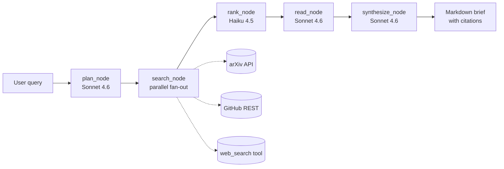

# Technical Research Agent

[](https://github.com/Shcherbin96/ai-research-agent/actions/workflows/tests.yml)
[](https://github.com/Shcherbin96/ai-research-agent/actions/workflows/eval.yml)

> Production-grade AI agent that researches a technical topic on demand and returns a grounded markdown brief with inline citations.

This is the MVP slice of the project described in [`01-technical-research-agent.md`](01-technical-research-agent.md). The full project also adds an eval pipeline (50 tasks, pass^4, LLM-as-judge), GitHub Actions CI, Mem0 long-term memory, Langfuse observability, and a Stagehand+Browserbase Google Scholar adapter — see "Roadmap" below.

## What it does

You give it a research query. It runs a four-step pipeline:

```
Plan → Search → Rank → Read → Synthesize
```

1. **Plan** (Sonnet 4.6) — decomposes your query into 3–6 focused subqueries.
2. **Search** — fans out across **arXiv** (academic API), **GitHub** (`/search/repositories`), and Anthropic's server-side **`web_search`** tool, in parallel.
3. **Rank** (Haiku 4.5) — picks the top 10 candidates from ~30–50 with diversity across sources.
4. **Read** (Sonnet 4.6) — for each selected source, fetches the body (arXiv abstract, GitHub README, or web snippet) and extracts a structured `ExtractedFact` with verbatim quotes.
5. **Synthesize** (Sonnet 4.6) — assembles the final Brief: executive summary, key findings, comparison matrix, open questions. **Every claim ends with a `[n]` citation marker tied to a source URL.**

## Quickstart

Requirements: Python 3.12+, [uv](https://docs.astral.sh/uv/), an Anthropic API key.

```bash
git clone <this-repo>
cd "Technical Research Agent"

uv sync
cp .env.example .env
# edit .env — set ANTHROPIC_API_KEY=sk-ant-...

uv run research-agent run "agent memory approaches in 2025-2026"
```

Output lands in `briefs/<timestamp>-<slug>.md`.

### CLI flags

```
uv run research-agent run QUERY
  --output-dir PATH        # default: briefs/
  --limit-per-source N     # default: 10
  --top-n N                # how many candidates to read in full (default: 10)
  --no-web                 # skip Anthropic web_search adapter (offline-friendly)
  --verbose                # print debug logs and per-adapter errors

uv run research-agent eval
  --task ID                # run only specific task ids (repeatable)
  --output-dir PATH        # default: eval/reports/
  --verbose
```

## Architecture



State is a flat `TypedDict` (`research_agent.state.ResearchState`); each node writes into one field. Graph wiring lives in [`src/research_agent/graph.py`](src/research_agent/graph.py).

## Project layout

```
src/research_agent/
  cli.py            Typer entry point
  config.py         env loading, model IDs
  state.py          ResearchState TypedDict
  models.py         pydantic: Candidate, ExtractedFact, Citation, Brief
  llm.py            Anthropic wrappers + JSON-tag parsing + web_search tool
  graph.py          LangGraph wiring
  render.py         Brief → markdown
  prompts.py        loads prompts/*.md
  nodes/            plan, search, rank, read, synthesize
  adapters/         arxiv, github, web_search

prompts/            plan.md, rank.md, read.md, synthesize.md
tests/              models, render, llm parsing
briefs/             output (gitignored)
```

## Eval

The agent ships with a small eval suite at [`eval/tasks.json`](eval/tasks.json) — five hand-curated tasks (three synthetic with known ground-truth URLs, two real research questions). Run it with:

```bash
uv run research-agent eval
```

Two metrics:

1. **Support rate** (all tasks). For every claim in `key_findings`, an LLM-as-judge (Haiku 4.5) decides whether the cited source actually supports the claim. Output: % of claims judged `supported`.
2. **Recall** (synthetic only). For each task with `must_have_urls`, we check whether those URLs appear in the brief's citations. Output: % of must-have URLs surfaced.

Reports land in `eval/reports/<timestamp>-report.{json,md}` and as artifacts in CI.

The full spec calls for **pass^4** (each task run 4 times, must succeed all 4) and a **pairwise usefulness comparison** between agent versions. These are deferred until the framework is in regular use.

## Observability (optional)

If you set `LANGFUSE_PUBLIC_KEY` and `LANGFUSE_SECRET_KEY` in `.env`, every node and LLM call is traced to [Langfuse](https://cloud.langfuse.com). Each run shows up as a hierarchical trace: top-level span → 5 node spans (`plan_node`, `search_node`, `rank_node`, `read_node`, `synthesize_node`) → individual LLM calls with token usage and prompts.

Without these keys, `@observe` is a no-op pass-through and the agent runs unchanged. Sign up free (50K observations/month) at https://cloud.langfuse.com.

## Google Scholar (optional)

If you set `BROWSERBASE_API_KEY` and `BROWSERBASE_PROJECT_ID` in `.env`, you can pass `--scholar` to enable a Google Scholar adapter that drives a cloud Chrome browser via [Browserbase](https://browserbase.com). Scholar has no public API, and Browserbase handles CAPTCHA solving + residential proxies that direct scraping cannot.

```bash
uv run research-agent run "vector retrieval beyond cosine similarity" --scholar
```

Scholar runs are billed by Browserbase per session — `--scholar` is off by default to keep eval cycles cheap.

## Long-term memory (optional)

If you set `MEM0_API_KEY` in `.env`, every completed brief is stored in [Mem0](https://app.mem0.ai/dashboard) tagged with the original query and citation URLs. When you run a new query, the planner retrieves the top-3 semantically-similar past briefs and uses them as warm context — so a follow-up query like *"recent advances in vector retrieval"* can leverage what was already learned about *"agent memory architectures"*.

Without the key, both `store` and `recall` are no-ops.

## Deploy (optional)

The agent can run as a Modal serverless function with a public HTTPS endpoint.

```bash
# One-time setup
uv pip install -e '.[deploy]'  # installs the modal client
modal token new                 # authenticate

# Configure the required secret (one-time)
# Modal dashboard → Secrets → New: name "anthropic-api-key", key ANTHROPIC_API_KEY=sk-ant-...

# Deploy
modal deploy modal_app.py
```

Modal prints a public URL like `https://<workspace>--ai-research-agent-research.modal.run`. Call it with:

```bash
curl -X POST https://<workspace>--ai-research-agent-research.modal.run \
  -H "Content-Type: application/json" \
  -d '{"query": "agent memory approaches in 2025-2026"}'
```

The endpoint returns JSON with the rendered markdown brief, run metrics, and the structured `Brief` object. See [`modal_app.py`](modal_app.py) for optional secrets (Langfuse / Mem0 / Browserbase) — uncomment them after configuring.

## CI

Two GitHub Actions workflows live in [`.github/workflows/`](.github/workflows/):

- **[`tests.yml`](.github/workflows/tests.yml)** — runs ruff + pytest on every push/PR.
- **[`eval.yml`](.github/workflows/eval.yml)** — runs the full eval suite on PRs that touch `src/`, `prompts/`, or `eval/`. Posts the markdown report as a PR comment and uploads JSON as an artifact. Eval needs `ANTHROPIC_API_KEY` configured as a repo secret.

## Tests

```bash
uv run pytest tests/
```

The tests cover pydantic round-trips, markdown rendering, the JSON-tag parser, and eval scoring. Live API calls are NOT tested in the default suite — run a real CLI invocation or the eval to smoke-test the agent end to end.

## Cost expectations

A typical run on a single query costs **<$0.50** with Sonnet 4.6 + Haiku 4.5 (10 sources × ~8k input tokens each in `read_node` after PDF parsing, plus one synthesis call). The full 5-task eval runs ~$2-3 and ~15-20 minutes.

## Out of scope (current state)

Still deferred; tracked on the roadmap below:

- Mem0 long-term memory across sessions
- Stagehand + Browserbase / Google Scholar adapter
- Modal / Railway cloud deploy + public link
- Langfuse traces / observability
- Web UI (FastAPI / Gradio / Streamlit)
- pass^4 reliability metric
- Pairwise usefulness comparison (needs a baseline version)
- Regression-blocking gate on the eval workflow

## Roadmap

1. ~~arXiv PDF reading~~ ✅
2. ~~Eval pipeline (5 hand-written tasks)~~ ✅
3. ~~GitHub Actions CI~~ ✅
4. ~~Langfuse traces~~ ✅
5. ~~Mem0 long-term memory cache~~ ✅
6. ~~Browserbase / Google Scholar~~ ✅
7. ~~Modal deploy~~ ✅
8. Grow eval to 50 tasks with pass^4
9. Pairwise usefulness comparison + regression gate
